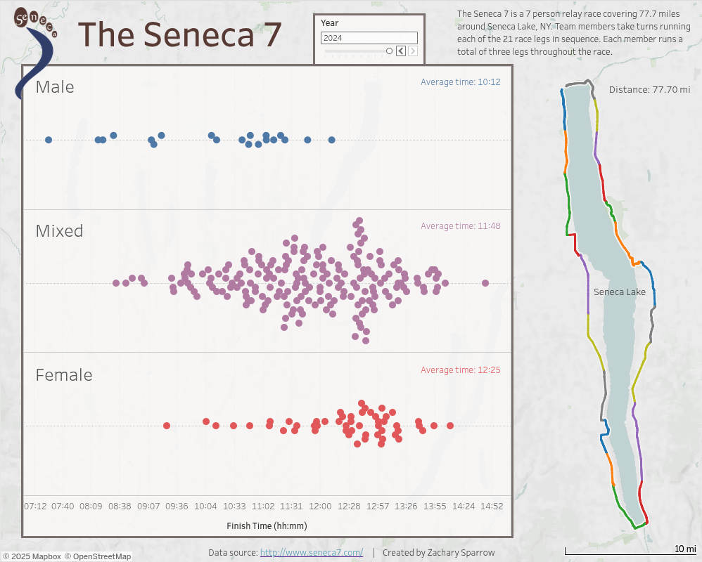

 

  

  <h3 align="center">The Seneca 7</h3>

  

    Results for the 2016-2024 Seneca 7 relay race
  

## About The Project
The Seneca 7 is a 7 person relay race covering 77.7 miles around Seneca Lake (see map below). 
The Seneca 7 started as a leadership-building exercise in 2011 for students of Hobart & William Smith Colleges, and has been held annually since it's inception (with virtual editions during the COVID-19 pandemic). 
Results have been recorded in a (semi-) standardized form since 2016, and can be found at <a href="http://www.seneca7.com/results">the race website</a>. 
The goal of this project is to scrape, clean, and visualize the data using Tableau.

## Explore the Data
Explore the data on Tableau Public! Here's a sneak peek...

  <a href="https://public.tableau.com/views/TheSeneca7/TheSeneca7?:language=en-US&:sid=&:redirect=auth&:display_count=n&:origin=viz_share_link">
    

You can filter the data by year and race leg by adjusting the slider and clicking segments on the map, respectively.

## Obtaining the Data
If you would like the data, simply download the SQLite database from data/seneca7_data.db.

## Scraping the Data
If you would like to scrape the data yourself, clone the repo and run the scrape_data.py script.

### Requirements
Python 3.9

Web scraping:
- js2py
- BeautifulSoup4
  
Cleaning and exporting:
- pandas
- sqlite3

## License
Distributed under the Unlicense License. See `LICENSE.txt` for more information.

